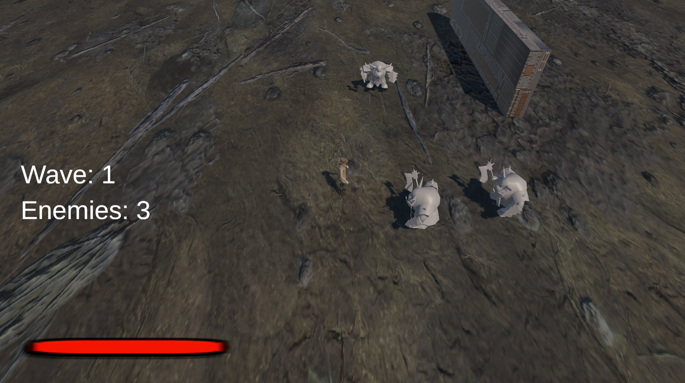
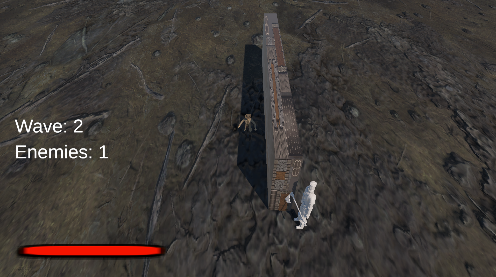
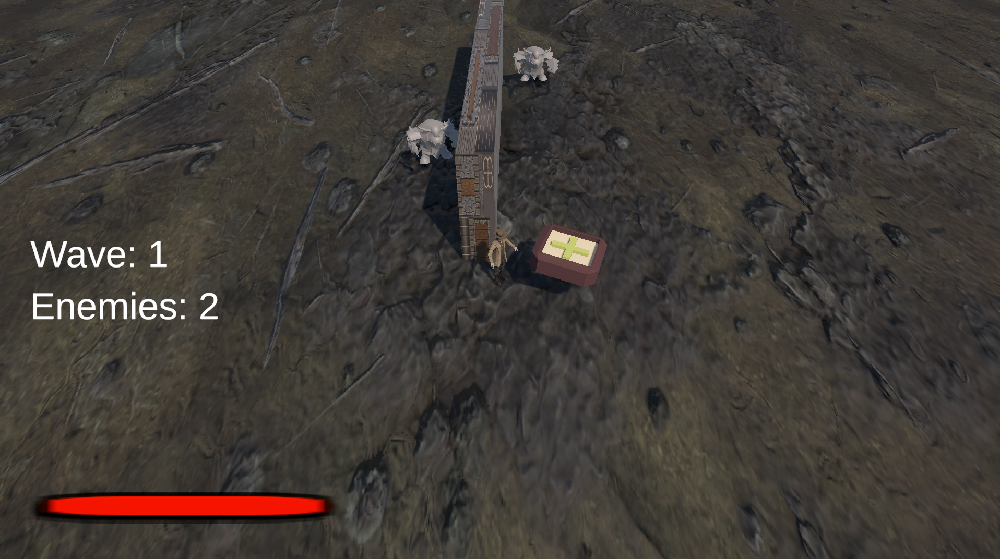
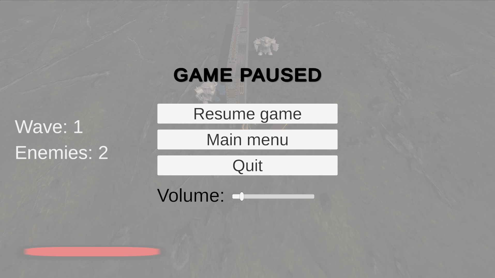
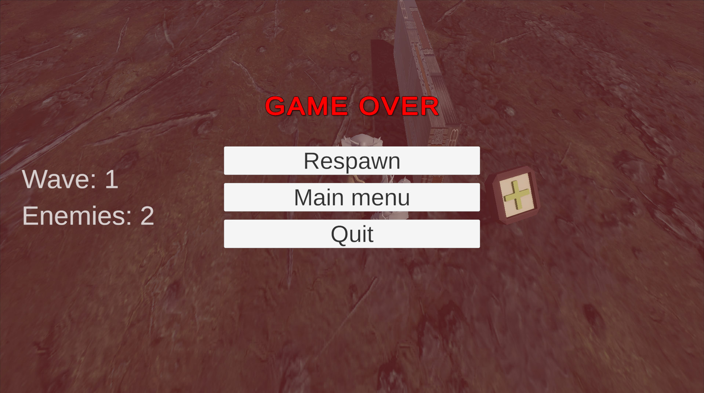
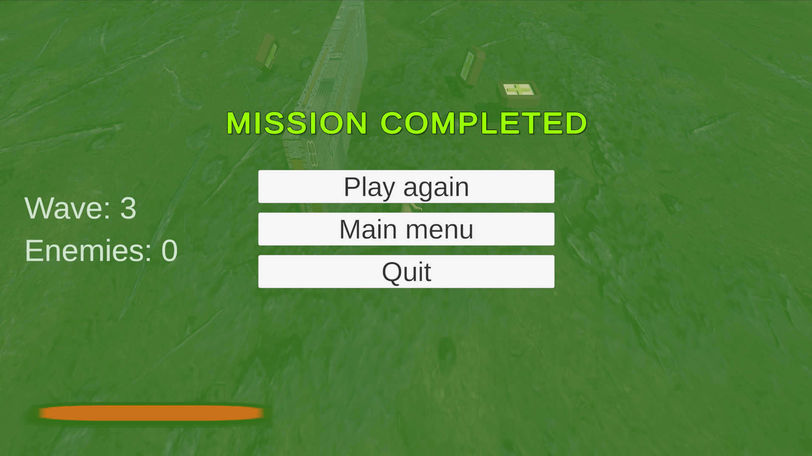

# Top Down Shooter на Unity

Небольшой top-down shooter, созданный на Unity для демонстрации навыков gameplay программирования.

Основной фокус проекта - архитектура кода, модульные системы и игровые механики, а не графика.

Проект демонстрирует:
- архитектуру игровых систем
- AI врагов
- оптимизацию через Object Pool
- событийную архитектуру
- систему волн
- систему лута

Видео демонстрация геймплея - https://youtu.be/6K3sfg5qnAQ

---

# Геймплей

Игрок сражается с волнами врагов на арене.

Враги используют AI на основе **Finite State Machine**, чтобы находить игрока, преследовать его и атаковать.

После смерти враги могут выбрасывать аптечки, которые восстанавливают здоровье игрока.

Игра заканчивается когда:

- игрок погибает
- или когда уничтожены все волны врагов

---

# Управление
- WASD - движение
- Мышь - прицеливание
- ЛКМ - стрельба
- ESC - пауза

---

# Скриншоты

## Gameplay



## AI врагов



## Подбор аптечки



## Меню паузы



## Экран поражения



## Экран победы



---

# Архитектура проекта

Проект построен на основе модульных игровых систем и событийной архитектуры.

Основные принципы:

- разделение ответственности между компонентами
- слабая связанность систем
- переиспользуемые компоненты
- data-driven подход

---

# Ключевые системы

## Enemy AI (Finite State Machine)

AI врагов реализован через **Finite State Machine**.

Основные состояния:

- Idle
- Chase
- Attack
- Search
- Stun

Каждое состояние реализовано отдельным классом.

Пример:

```csharp
public class EnemyIdleState : EnemyState
{
    public EnemyIdleState(EnemyStateMachine sm) : base(sm) {}

    public override void Update()
    {
        var targetSystem = StateMachine.GetComponent<EnemyTargetSystem>();

        if (targetSystem.CurrentTarget != null)
        {
            StateMachine.ChangeState(StateMachine.ChaseState);
        }
    }
}
```

Такой подход делает AI:

* легко расширяемым
* удобным для дебага
* читаемым

---

## Object Pool

Для предотвращения частых операций `Instantiate / Destroy` используется **Object Pool**.

Object Pool применяется для:

* врагов
* bullet tracer

Преимущества:

* уменьшение нагрузки на Garbage Collector
* предотвращение лагов
* более стабильная производительность

---

## Wave System (ScriptableObject)

Волны врагов настраиваются через **ScriptableObject**.

Это позволяет изменять конфигурацию волн без изменения кода.

Пример структуры:

```csharp
[System.Serializable]
public class WaveData
{
    public EnemyGroup[] enemies;
}
```

Каждая волна может содержать несколько типов врагов.

---

## Event Driven Gameplay

Системы взаимодействуют через события вместо прямых ссылок.

Пример:

```
EnemyHealth → OnDeath
WaveManager → слушает событие
UI → слушает событие
DropSystem → слушает событие
```

Преимущества:

* слабая связанность систем
* более чистая архитектура
* проще добавлять новые системы

---

# Структура проекта

```
Scripts
 ├ Core
 ├ Enemy
 ├ Player
 ├ Systems
 ├ Waves
 ├ Combat
 ├ Pooling
 ├ UI
 ├ Effects
 └ Pickups
```

---

# Использованные технологии

```
Unity
C#
URP
```

---

# Автор

Портфолио-проект программиста Бобоева Азизджона Рахматовича.
